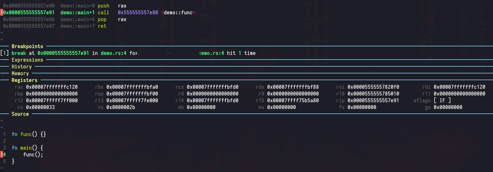

stack overflow
==============

這個 stack overflow 並不是指程式設計師用的問答網站的那個 stackoverflow ，而是實際的堆疊溢位，也就是堆疊中的資料存取超過範圍了，那麼會怎麼樣呢？

```rust
use std::ptr;

fn main() {
  // 長度為 0 的 array ，這也是可以的喔
  let mut a = [0u8; 0];
  unsafe {
    // 硬是寫 30 個 bytes 的 0 進去
    ptr::write_bytes(a.as_mut_ptr(), 0, 30);
  }
}
```

這邊的 30 其實只是個大概抓的數字，只要夠大就可以有接下來的效果，另外其實這邊也可以看到 Rust 的安全性，這邊如果不用 unsafe 的程式碼平常根本做不到這種事情，那我們還是把這個程式執行看看吧，不知道你是不是已經猜到結果了， `segmentation fault`

只是這次是發生了什麼事情呢，我們用 `gdb` 來觀察看看，開個終端機輸入：

```shell
$ gdb <exe path>
```

這邊的 `exe path` 是你的執行檔的路徑喔，然後輸入 `r` 讓程式跑起來，沒意外的話應該還是會發生一樣的 `segmentation fault` ，接著輸入 `bt` 來看看錯誤是發生在哪個位置：

```plain
>>> r
Starting program: ...
Program received signal SIGSEGV, Segmentation fault.
>>> bt
#0  0x0000000000000000 in ?? ()
#1  0x0000000000000000 in ?? ()
```

你應該會看到類似上面的輸出， `bt` 指令顯示的是出錯的記憶體位置，以及函式的名稱，另外它還能往回找函式呼叫的順序，真的很方便，但這邊似乎不太對，它顯示的記憶體位置是 0 啊，等等，我們把上面填入的數字改成 `0xff` 看看：

```rust
// 改成這樣
ptr::write_bytes(a.as_mut_ptr(), 0xff, 30);
```

```plain
>>> bt
#0  0xffffffffffffffff in ?? ()
#1  0xffffffffffffffff in ?? ()
#2  0xffffffffffffffff in ?? ()
#3  0x00007fffffffffff in ?? ()
#4  0x000055555555e723 in std::rt::lang_start_internal::{{closure}} () at src/libstd/rt.rs:49
#5  std::panicking::try::do_call () at src/libstd/panicking.rs:296
#6  0x000055555555feea in __rust_maybe_catch_panic () at src/libpanic_unwind/lib.rs:80
#7  0x000055555555f19d in std::panicking::try () at src/libstd/panicking.rs:275
#8  std::panic::catch_unwind () at src/libstd/panic.rs:394
#9  std::rt::lang_start_internal () at src/libstd/rt.rs:48
#10 0x0000555555558069 in std::rt::lang_start (main=0x555555557f50 <demo::main>, argc=1, argv=0x7fffffffc228) at /rustc/eb48d6bdee6c655d71f26594d47d232adf3e4e93/src/libstd/rt.rs:64
#11 0x0000555555557faa in main ()
#12 0x00007ffff6fbbb97 in __libc_start_main (main=0x555555557f80 <main>, argc=1, argv=0x7fffffffc228, init=<optimized out>, fini=<optimized out>, rtld_fini=<optimized out>, stack_end=0x7fffffffc218) at ../csu/libc-start.c:310
#13 0x0000555555557d7a in _start ()
```

這次位置反而變成 `0xffffffffffffffff`，所以我們到底覆寫到了什麼呢，為什麼我們的程式會執行到我們寫入的位置呢

函式呼叫
--------

說來，函式在呼叫後又是怎麼知道誰是呼叫它的函式呢？不然為什麼函式在呼叫後可以從呼叫的地方繼續執行，還記得我們之前提到的堆疊嗎，那個堆疊裡實際上存著的可不是只有區域變數而已，還有一個很重要的東西，函式呼叫時的返回位置，函式結束時將會透過這個位置來回到呼叫的位置繼續執行，在組合語言內呼叫函式最重要的就是這兩個指令：

- `call` ：將目前程式執行到的位置保存到堆疊，並跳到指定的位置 (通常就是函式的開頭了)
- `ret` ：從堆疊取出返回位置，跳回去

我們試著在 `gdb` 中觀察函式執行的過程，不過為了方便，我們先來安裝 [`gdb-dashboard`][gdb-dashboard] ，它可以在當 gdb 執行程式並停下來時自動顯示各種資料，比如原始碼、組語、暫存器的狀態等等，可以讓我們使用 gdb 時方便很多，如果你有安裝好應該會是像這樣：



[gdb-dashboard]: https://github.com/cyrus-and/gdb-dashboard

雖說上面的圖中也有出現，不過我們先來準備一個簡單的程式碼：

```rust
fn func() {}

fn main() {
  func();
}
```

然後編譯好用 gdb 打開，輸入 `b 4`，意思是在第 4 行設定中斷點，再輸入 `r` 開始執行應該就會看到像上面的圖一樣的畫面了，同時我們也可以看到組語的部份是這樣的：

```plain
0x0000555555557e90  demo::main+0 push   rax
0x0000555555557e91  demo::main+1 call   0x555555557e80 <demo::func>
0x0000555555557e96  demo::main+6 pop    rax
```

第二行就是呼叫我們的 function 的部份，這時我們輸入 `si` ，讓 gdb 進入我們的函式，函式的組語應該只有一行，正是我們的 `ret`

```plain
0x0000555555557e80  demo::func+0 ret
```

這時我們來看看堆疊上有什麼，輸入 `x/1x $rsp` ，這會把堆疊上的第一個值顯示出來

```plain
>>> x/1xg $rsp
0x7fffffffbef8: 0x0000555555557e96
```

再對照一下上面 `main` 的組語，你會發現這個位置正好是執行完 `call` 後的位置，也就是函式執行完後該返回的位置

既然如此，那我們這樣覆寫堆疊的資料不就把堆疊中的返回位置蓋過去了嗎？自然而然的函式在返回時就執行到了其它地方去了，到這邊不知道你有沒有一個疑問， `main` 不是程式開始的點嗎，那為什麼還有地方可以回去呢，它上面還有別的東西呼叫它嗎？關於這個答案，你可以先看看上面那個 `bt` 執行的結果再想一想， `main` 真的是程式開始執行的地方嗎？

這篇的內容就先到這邊，下一篇會再來探討 stack overflow 所造成的安全性問題，以及現在電腦所使用的保護機制
